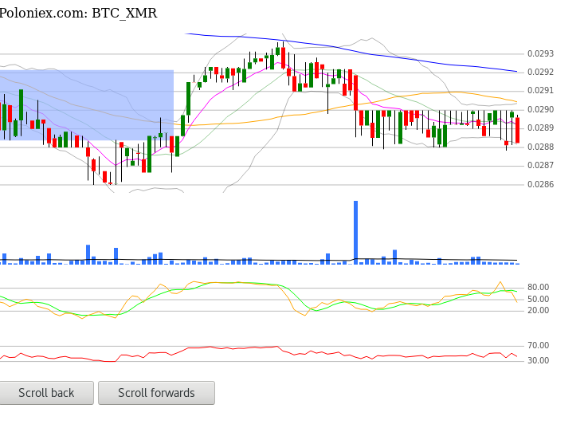

# CryptoTracker v0.1.0 GPLv3

Simple HTML5/Javascript cryptoportfolio tracker, pulls data from Poloniex.com public API and charts it.



# Installation and Running

```
$ git clone git@github.com:wolfmankurd/CryptoTracker.git
$ cd CryptoTracker
$ npm install request
$ node CryptoTracker.js
```

# Dependencies

* NodeJS and request module.
* [JQuery](http://jquery.com/) using 3.2.1 hosted via Googleapis.com
* [DojiChart](http://dojichart.com/)

